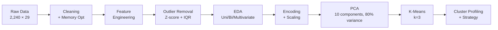

<div align="center">

# 🛍️ Customer Segmentation & Behavioral Analysis

### *Unsupervised Marketing Analytics on 2,240 Retail Customers*

**By Gheffari Nour El Houda**

<br>


<br>


</div>

---

> 🎯 **End-to-end customer segmentation pipeline** using K-Means, PCA, and t-SNE on a marketing campaign dataset of 2,240 customers — identifying three actionable segments (**VIPs**, **Mid-Value Growth**, **Price-Sensitive**) with concrete marketing strategies for each. VIPs spend **5.6× more** and purchase **2.3× more frequently** than the lowest-value segment.

📄 [Read the full report](report/report.pdf)

---

## 📸 Project Highlights


---

## 📑 Table of Contents

- [🏪 Business Context](#-business-context)
- [❓ Questions This Project Answers](#-questions-this-project-answers)
- [📊 Dataset](#-dataset)
- [🧭 Methodology](#-methodology)
- [🔍 Key Findings](#-key-findings)
- [👥 The Three Customer Segments](#-the-three-customer-segments)
- [💼 Business Strategies per Segment](#-business-strategies-per-segment)
- [🧰 Tech Stack](#-tech-stack)
- [📁 Project Structure](#-project-structure)
- [🚀 Reproduce This Project](#-reproduce-this-project)
- [🎓 Skills Demonstrated](#-skills-demonstrated)

---

## 🏪 Business Context

Customer segmentation divides a customer base into groups sharing similar characteristics, allowing businesses to **personalize marketing**, **improve engagement**, and **increase conversion**. This project addresses retail customer segmentation using **unsupervised learning** — since no labels exist, clustering uncovers hidden groups from demographic and behavioral patterns. The output is not just clusters, but **actionable business recommendations** for targeted marketing.

---

## ❓ Questions This Project Answers

- **Who are our customers?** Demographic and behavioral profile of the customer base.
- **What defines each customer segment?** Income, spending, family structure, engagement.
- **How do segments differ?** In spending, purchasing channels, and campaign responsiveness.
- **How can marketing be tailored?** Concrete, segment-specific strategies and KPIs.

---

## 📊 Dataset

**Source:** Marketing Campaign Dataset — **2,240 customers** × **29 features**

| Category | Features |
|----------|----------|
| **Demographics** | Year of birth, education, marital status, income, kids at home, teens at home |
| **Engagement** | Days since last purchase (Recency), customer tenure, complaints |
| **Spending (2-year)** | Wine, fruits, meat, fish, sweets, gold products |
| **Channels** | Web, catalog, in-store purchases, web visits per month |
| **Campaigns** | Response to 5 past marketing campaigns |

The mix of demographic, behavioral, and transactional features makes this dataset ideal for **multi-dimensional segmentation** rather than simple demographic splits.

---

## 🧭 Methodology



**Pipeline highlights:**

- **Data cleaning:** Dropped 24 rows with missing income (1.1% of data); removed zero-variance columns (`Z_CostContact`, `Z_Revenue`)
- **Feature engineering:** Built `Age`, `Days_is_client`, `Kids` (combined children + teenagers), `Expenses` (total spend across all categories), `TotalNumPurchases` (across all channels), `TotalAcceptedCmp` (campaign responsiveness); standardized education into 3 groups and marital status into 2 groups
- **Outlier handling:** Two-stage approach — z-score > 3, then IQR — removing 18 extreme outliers
- **Dimensionality reduction:** PCA retaining **10 components explaining 80% of variance**; t-SNE used for visualization only (not clustering input)
- **Cluster selection:** Elbow method confirmed **k=3** as optimal
- **Memory optimization:** Reduced DataFrame memory footprint by **78%** through dtype optimization

---

## 🔍 Key Findings

### The Income → Expenses → Purchases Chain

The single most important pattern in the data is a strong positive chain between three variables:

| Relationship | Correlation |
|--------------|------------:|
| Income ↔ Expenses | **0.83** |
| Expenses ↔ Total Purchases | **0.76** |
| Income ↔ Total Purchases | **0.71** |

**Higher income drives higher spending, which drives higher purchase frequency.** This chain persists across all subgroups — kids, marital status, education shift customers *along* the curve, but never break it.

### What Moves Customers Along the Curve

- **Family size:** Customers with **0 kids** earn more, spend more, and purchase more frequently. As family size grows, all three metrics drop.
- **Education:** Postgraduates earn the most, spend the most, and purchase the most. Undergraduates are lowest across all three.
- **Marital status:** Partnered customers earn and spend more than singles (consistent with dual-income households).

### What Doesn't Matter Much

- **Age** alone is a weak predictor — once income is controlled for, age groups behave similarly.
- **Recency** and **tenure** show similar distributions across all subgroups — engagement timing is independent of customer value.
- **Complaints** are rare (under 1% of customers) and don't predict churn-like behavior.

### Campaign Responsiveness

| Driver | Correlation with Response |
|--------|--------------------------:|
| Expenses | **+0.26** |
| Recency (negative) | **−0.20** |
| Income | **+0.17** |
| Past campaign acceptance | **+0.15** |

**Customers who already spend a lot and bought recently respond best to campaigns** — and past responders are more likely to respond again. This is the foundation of the targeting strategies below.

---

## 👥 The Three Customer Segments

After K-Means clustering on PCA-reduced features, three clear segments emerged. All numbers below are **means per cluster**, computed on the original (un-scaled) feature values.

| Metric | 🌟 Cluster 0<br/>**VIPs** | 📈 Cluster 1<br/>**Mid-Value Growth** | 💸 Cluster 2<br/>**Price-Sensitive** |
|--------|---------:|---------:|---------:|
| **Avg. Age** | 46 | 48 | 40 |
| **Avg. Income** | $70,543 | $43,416 | $35,507 |
| **Days as Client** | 378 | 329 | 339 |
| **Avg. Expenses** | $1,200 | $213 | $159 |
| **Avg. Purchases** | 21.5 | 11.7 | 9.3 |
| **Campaigns Accepted** | 0.60 | 0.10 | 0.07 |
| **Last Campaign Response** | 23.8% | 10.5% | 8.1% |
| **Complaint Rate** | 0.4% | 1.7% | 1.0% |

### 🌟 Cluster 0 — High-Value Loyal Customers (VIPs)

- **Demographics:** Middle-aged to older (45–60), highest income (~$70k+), longest tenure, mostly partnered with 0–1 kids
- **Behavior:** Premium spenders, frequent buyers, **most responsive to campaigns** (6× the campaign acceptance of other segments)
- **Strategic value:** Revenue concentration — this segment drives a disproportionate share of total revenue

### 📈 Cluster 1 — Mid-Value Growth Customers

- **Demographics:** Middle-aged (40–55), moderate income (~$43k), mixed marital status, typically 1–2 kids
- **Behavior:** Moderate spending and purchase frequency, occasional campaign responders, some outliers spending at VIP levels
- **Strategic value:** Largest upside potential — already engaged, room to grow

### 💸 Cluster 2 — Low-Value / Price-Sensitive Customers

- **Demographics:** Youngest (30–45), lowest income (~$35k), shortest tenure, mostly single with 0–1 kids
- **Behavior:** Low spending, infrequent purchases, low campaign response, price-sensitive shopping
- **Strategic value:** High volume, low margin — efficiency over depth

---

## 💼 Business Strategies per Segment

| Segment | Strategy | Channels | KPI to Track |
|---------|----------|----------|--------------|
| 🌟 **VIPs** | VIP loyalty programs, premium bundles, early access to new products, personalized communication, exclusive events | Personalized email, catalog | Retention rate, customer lifetime value |
| 📈 **Mid-Value Growth** | Targeted promotions, bundle offers, personalized recommendations from purchase history, loyalty point incentives | Email, catalog, retargeting | Campaign response rate, average order value |
| 💸 **Price-Sensitive** | Entry-level products, limited-time discounts, automated low-cost engagement (email/SMS), onboarding campaigns | Web ads, SMS, automated email | Conversion rate, cost per acquisition |

> 💡 **Key business insight:** VIPs accept campaigns at **6×** the rate of other segments while making up a smaller share of the customer base. Concentrating premium offers on this segment maximizes marketing ROI. Mid-Value customers should receive growth-oriented offers; Price-Sensitive customers should be reached through low-cost automated channels.

---

## 🧰 Tech Stack

| Layer | Tools |
|-------|-------|
| **Language** | Python 3.10+ |
| **Data Manipulation** | pandas, NumPy |
| **Visualization** | matplotlib, seaborn, plotly |
| **ML & Clustering** | scikit-learn (KMeans, PCA, StandardScaler, silhouette_score) |
| **Dimensionality Reduction** | scikit-learn PCA, scikit-learn TSNE |
| **Notebook Environment** | Jupyter |

---

## 📁 Project Structure

```
customer-segmentation-marketing-analytics/
├── data/
│   ├── raw/                       # Original marketing campaign dataset
│   └── processed/                 # Cleaned and feature-engineered data
├── notebooks/
│   └── segmentation.ipynb         # Main end-to-end analysis notebook
├── docs/
│   └── images/                    # Headline visualizations (image1–5)
├── assets/                        # Notebook output figures
├── report/
│   └── report.pdf                 # Full written report
├── requirements.txt
└── README.md
```

---

## 🚀 Reproduce This Project

```bash
# 1. Clone the repository
git clone https://github.com/houdhoudGH/customer-segmentation-marketing-analytics.git
cd customer-segmentation-marketing-analytics

# 2. Create a virtual environment
python -m venv venv
source venv/bin/activate          # On Windows: venv\Scripts\activate

# 3. Install dependencies
pip install -r requirements.txt

# 4. Launch the notebook
jupyter notebook notebooks/segmentation.ipynb
```

---

## 🎓 Skills Demonstrated

- **Unsupervised learning workflow:** End-to-end clustering pipeline from raw data to business insight
- **Feature engineering:** Building behavior-driven features from raw transactional data
- **Model selection rigor:** Two-method cluster validation (elbow + silhouette) rather than picking k by intuition
- **Dimensionality reduction:** PCA for clustering input, t-SNE for visualization — knowing which to use when
- **Outlier handling:** Combined z-score and IQR approach with justification
- **Business translation:** Turning abstract cluster IDs into named personas with concrete marketing actions
- **Memory optimization:** 78% reduction in memory footprint through dtype management
- **Visual storytelling:** Plots that communicate findings to non-technical stakeholders

---

<div align="center">

### 🎓 About This Project

This project was developed as part of a data science exploration into **unsupervised learning** and **customer analytics**.
It demonstrates the end-to-end clustering workflow — from raw data to **actionable business strategy**.

<br>

**Made with 💜 by Gheffari Nour El Houda**

📧 nourgheffari@gmail.com · 🔗 [GitHub](https://github.com/houdhoudGH)

<sub>If you found this useful, consider giving the repo a ⭐</sub>

</div>
