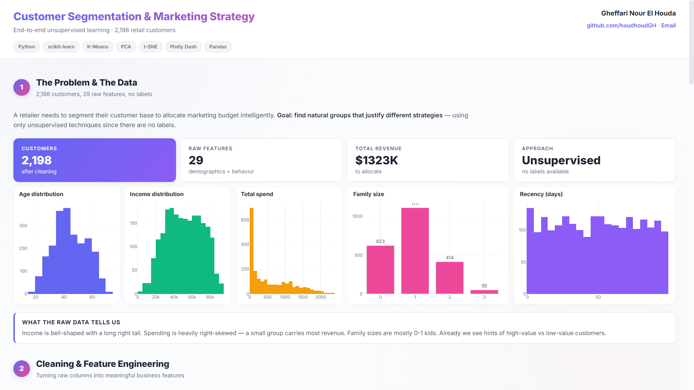
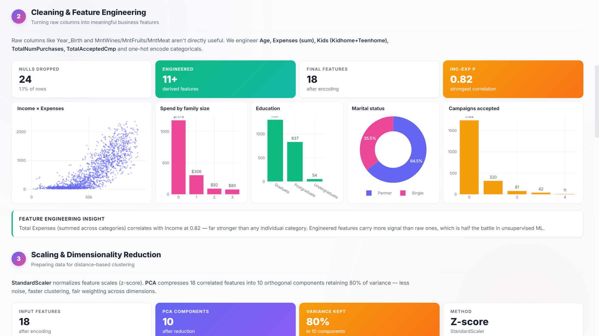
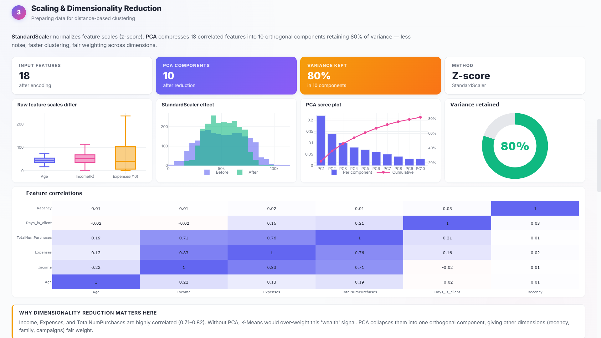
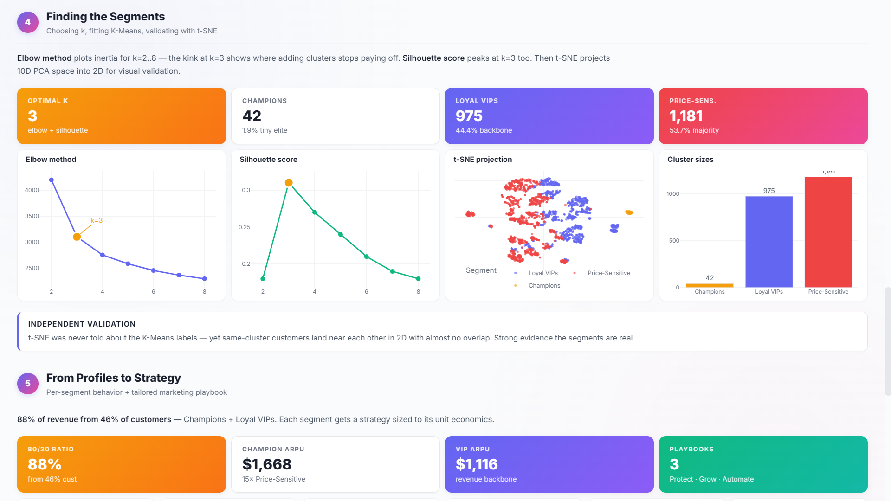
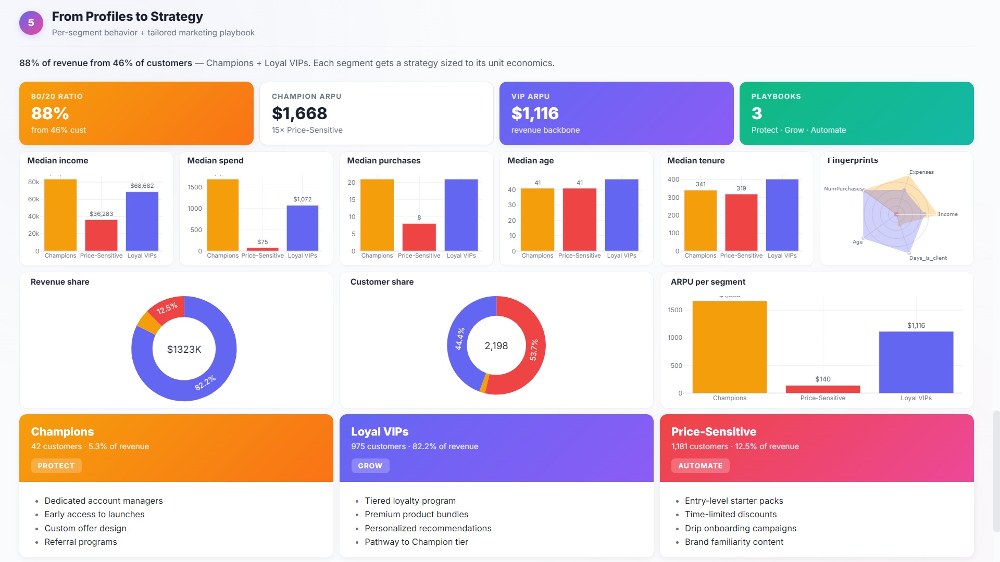
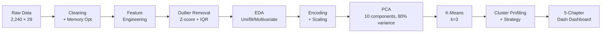

<div align="center">

# 🛍️ Customer Segmentation & Behavioral Analysis

### *From 2,240 raw customer records → three named segments → an interactive 5-chapter dashboard with concrete marketing playbooks.*

**By Gheffari Nour El Houda**

<br>


<br>


<br>

This isn't an EDA notebook with charts and a cluster count. It's an end-to-end **marketing intelligence deliverable**: clean data, find the segments, name them, profile them, and ship the findings as an **interactive 5-chapter Dash dashboard** that tells the story to a non-technical stakeholder — with KPIs, narrative copy, and a concrete playbook for each segment.
The ML is real (PCA, K-Means, silhouette validation), but the output is what a marketing director actually wants: **"who are my customers, what do they want, and what should I do about it."**

</div>

---

## 📊 The Dashboard

A 5-chapter story dashboard built in **Dash + Plotly**, designed to read top-to-bottom like a marketing report — KPI cards, plots, narrative captions, and segment playbooks. The full app is in [`app.py`](app.py).

<br>


*Chapter 1 — Who are our customers? Demographic snapshot of the 2,240-customer base.*

<br>


*Chapter 2 — Behavior. Spending, channels, and engagement signals after feature engineering and outlier removal.*

<br>


*Chapter 3 — Hidden relationships. Multivariate analysis surfaces the **Income → Expenses → Purchases chain** that defines the customer base.*

<br>


*Chapter 4 — Discovering the segments. PCA, elbow + silhouette validation, t-SNE visualization, K-Means with k=3.*

<br>


*Chapter 5 — The playbook. Each segment gets a profile card, strategic value statement, channel mix, and a concrete marketing action plan.*

---

## 🎯 The Headline Insight

> **VIPs spend 5.6× more and buy 2.3× more often than the lowest-value segment — and they accept marketing campaigns at 6× the rate.**
> Concentrating premium offers on this segment is the single highest-ROI marketing move available in the data.

---

## 📑 Table of Contents

- [💼 The Business Problem](#-the-business-problem)
- [❓ The Questions](#-the-questions)
- [📊 The Data](#-the-data)
- [🧭 The Method](#-the-method)
- [🔍 What the Data Revealed](#-what-the-data-revealed)
- [👥 The Three Segments](#-the-three-segments)
- [💡 The Marketing Playbook](#-the-marketing-playbook)
- [🖥️ The Dashboard](#%EF%B8%8F-the-dashboard-1)
- [🚀 Run It Yourself](#-run-it-yourself)
- [🧰 Tech Stack](#-tech-stack)
- [🎓 Skills Demonstrated](#-skills-demonstrated)

---

## 💼 The Business Problem

A marketing team can't talk to 2,240 customers individually — and treating them all the same wastes the budget. The team needs **segments**: groups of customers similar enough to deserve the same marketing treatment, but different enough from each other that the treatment actually matters.

The catch: nobody has pre-labeled the customers. There is no "VIP" flag in the database. The segments have to be **discovered from behavior**, not assumed from demographics.

That's a textbook unsupervised learning problem — and the deliverable isn't a confusion matrix. It's a clear answer to: *who are these segments, what do they want, and what should marketing do for each one tomorrow morning.*

---

## ❓ The Questions

The project was built around four business questions:

- **Who are our customers?** Demographic and behavioral profile of the full base.
- **What hidden segments exist?** Groups defined by behavior, not by intuition.
- **How are the segments different?** Spending, channels, campaign responsiveness.
- **What should marketing do about it?** Per-segment, concrete actions and KPIs.

---

## 📊 The Data

**Source:** Marketing Campaign Dataset — **2,240 customers** × **29 features**

| Category          | Features |
|-------------------|----------|
| **Demographics** | Year of birth, education, marital status, income, kids at home, teens at home |
| **Engagement**   | Days since last purchase (Recency), customer tenure, complaints |
| **Spending (2-year)** | Wine, fruits, meat, fish, sweets, gold products |
| **Channels**     | Web, catalog, in-store purchases, web visits per month |
| **Campaigns**    | Response to 5 past marketing campaigns |

The mix of demographic, behavioral, and transactional features is what makes this dataset suitable for **multi-dimensional segmentation** — simple "split by income" would miss most of the signal.

---

## 🧭 The Method



**Pipeline highlights:**

- **Data cleaning:** Dropped 24 rows with missing income (1.1% of data); removed zero-variance columns (`Z_CostContact`, `Z_Revenue`)
- **Feature engineering:** Built `Age`, `Days_is_client`, `Kids` (combined children + teenagers), `Expenses` (total spend across categories), `TotalNumPurchases` (across all channels), `TotalAcceptedCmp` (campaign responsiveness); collapsed education into 3 groups, marital status into 2 groups
- **Outlier handling:** Two-stage — z-score > 3, then IQR — removing 18 extreme outliers
- **Dimensionality reduction:** PCA retaining **10 components explaining 80% of variance**; t-SNE used for visualization only (not clustering input)
- **Cluster selection:** Elbow method confirmed **k=3** as optimal; silhouette score validated the choice
- **Memory optimization:** Reduced DataFrame memory footprint by **78%** through dtype optimization
- **Delivery:** Five-chapter Dash dashboard with narrative captions, KPI cards, and per-segment playbook cards — designed to be read by a marketing director, not a data scientist

---

## 🔍 What the Data Revealed

### The Income → Expenses → Purchases Chain

The single most important pattern in the entire dataset is a tight three-way positive chain:

| Relationship              | Correlation |
|---------------------------|------------:|
| Income ↔ Expenses        | **0.83** |
| Expenses ↔ Total Purchases | **0.76** |
| Income ↔ Total Purchases | **0.71** |

**Higher income drives higher spending, which drives higher purchase frequency.** This chain holds across every subgroup tested — kids, marital status, and education shift customers *along* the curve, but they never break it. This finding alone reframed the segmentation: the segments aren't *demographic* groups, they're *value* groups, and the demographics just shift you up or down the value axis.

### What Moves Customers Along the Curve

- **Family size:** Customers with **0 kids** earn more, spend more, and purchase more frequently. Every additional kid drags all three metrics down.
- **Education:** Postgraduates earn the most, spend the most, purchase the most. Undergraduates are lowest across all three.
- **Marital status:** Partnered customers earn and spend more than singles (consistent with dual-income households).

### What Doesn't Matter (and Why That's Useful)

- **Age** alone is a weak predictor — once income is controlled for, age groups behave similarly. *Marketing implication: don't segment by age.*
- **Recency** and **tenure** show similar distributions across all subgroups — engagement timing is independent of customer value. *Marketing implication: don't write off long-quiet customers.*
- **Complaints** are rare (<1%) and don't predict churn-like behavior. *Marketing implication: complaints are noise, not signal.*

### Campaign Responsiveness

| Driver                  | Correlation with Response |
|-------------------------|--------------------------:|
| Expenses                | **+0.26** |
| Recency (negative)     | **−0.20** |
| Income                  | **+0.17** |
| Past campaign acceptance | **+0.15** |

**The customers who already spend a lot and bought recently respond best — and past responders are likely to respond again.** This is the foundation of the per-segment targeting strategies below.

---

## 👥 The Three Segments

After K-Means clustering on PCA-reduced features, three clear segments emerged. All numbers below are **means per cluster**, computed on the original (un-scaled) feature values.

| Metric                     | 🌟 Cluster 0<br/>**VIPs** | 📈 Cluster 1<br/>**Mid-Value Growth** | 💸 Cluster 2<br/>**Price-Sensitive** |
|----------------------------|---------:|---------:|---------:|
| **Avg. Age**               | 46       | 48       | 40       |
| **Avg. Income**            | $70,543  | $43,416  | $35,507  |
| **Days as Client**         | 378      | 329      | 339      |
| **Avg. Expenses**          | $1,200   | $213     | $159     |
| **Avg. Purchases**         | 21.5     | 11.7     | 9.3      |
| **Campaigns Accepted**     | 0.60     | 0.10     | 0.07     |
| **Last Campaign Response** | 23.8%    | 10.5%    | 8.1%     |
| **Complaint Rate**         | 0.4%     | 1.7%     | 1.0%     |

### 🌟 Cluster 0 — High-Value Loyal Customers (VIPs)

- **Demographics:** Middle-aged to older (45–60), highest income (~$70k+), longest tenure, mostly partnered with 0–1 kids
- **Behavior:** Premium spenders, frequent buyers, **most responsive to campaigns** (6× the campaign acceptance of other segments)
- **Strategic value:** Revenue concentration — this segment drives a disproportionate share of total revenue

### 📈 Cluster 1 — Mid-Value Growth Customers

- **Demographics:** Middle-aged (40–55), moderate income (~$43k), mixed marital status, typically 1–2 kids
- **Behavior:** Moderate spending and purchase frequency, occasional campaign responders, some outliers spending at VIP levels
- **Strategic value:** Largest upside potential — already engaged, room to grow

### 💸 Cluster 2 — Low-Value / Price-Sensitive Customers

- **Demographics:** Youngest (30–45), lowest income (~$35k), shortest tenure, mostly single with 0–1 kids
- **Behavior:** Low spending, infrequent purchases, low campaign response, price-sensitive shopping
- **Strategic value:** High volume, low margin — efficiency over depth

---

## 💡 The Marketing Playbook

Each segment gets a concrete, prioritized action plan — visible as a card in the final chapter of the dashboard.

| Segment              | Strategy | Channels | KPI to Track |
|----------------------|----------|----------|--------------|
| 🌟 **VIPs**          | VIP loyalty programs, premium bundles, early access to new products, personalized communication, exclusive events | Personalized email, catalog | Retention rate, customer lifetime value |
| 📈 **Mid-Value Growth** | Targeted promotions, bundle offers, personalized recommendations from purchase history, loyalty point incentives | Email, catalog, retargeting | Campaign response rate, average order value |
| 💸 **Price-Sensitive** | Entry-level products, limited-time discounts, automated low-cost engagement, onboarding campaigns | Web ads, SMS, automated email | Conversion rate, cost per acquisition |

> 💡 **The single most important takeaway:** VIPs respond to campaigns at **6× the rate** of other segments while spending **5.6× more on average**. Concentrating premium offers on this segment maximizes marketing ROI. Mid-Value should receive growth-oriented offers; Price-Sensitive should be reached through low-cost automated channels.

---

## 🖥️ The Dashboard

The findings ship as an interactive **Dash + Plotly** app — five chapters, designed to be read top-to-bottom by a marketing decision-maker.

**Why a dashboard and not just a notebook?**
Because a notebook is for analysis; a dashboard is for *delivery.* A marketing director doesn't want to scroll through 130 code cells — they want a single page that opens with KPI cards, walks through the story, and ends with an action plan per segment.

**What the dashboard contains:**

- **Chapter 1 — Who Are Our Customers?** Demographic overview, age and income distributions, family structure breakdown
- **Chapter 2 — Customer Behavior** Spending patterns, channel preferences, engagement signals
- **Chapter 3 — Hidden Relationships** The Income → Expenses → Purchases chain visualized through correlation analysis
- **Chapter 4 — Discovering the Segments** PCA explained variance, elbow + silhouette validation, t-SNE 2D visualization, K-Means assignment
- **Chapter 5 — The Playbook** One card per segment: profile, strategic value, channel mix, recommended actions, KPI to track

Each chapter has **KPI cards**, **plot panels**, and **insight callouts** in plain English — the dashboard reads like a consulting report, not a debug notebook.

---

## 🚀 Run It Yourself

```bash
# 1. Clone the repository
git clone https://github.com/houdhoudGH/customer-segmentation-marketing-analytics.git
cd customer-segmentation-marketing-analytics

# 2. Create a virtual environment
python -m venv venv
source venv/bin/activate          # Windows: venv\Scripts\activate

# 3. Install dependencies
pip install -r requirements.txt

# 4a. Run the full analysis notebook
jupyter notebook notebooks/segmentation.ipynb

# 4b. OR launch the dashboard directly
python app.py
# → open http://127.0.0.1:8050 in your browser
```

---

## 🧰 Tech Stack

| Layer | Tools |
|-------|-------|
| **Language**             | Python 3.10+ |
| **Data Manipulation**    | pandas, NumPy |
| **ML & Clustering**      | scikit-learn (KMeans, PCA, StandardScaler, silhouette_score, TSNE) |
| **Static Visualization** | matplotlib, seaborn |
| **Interactive Dashboard**| Dash, Plotly, dash-bootstrap-components |
| **Notebook Environment** | Jupyter |
| **Data Storage**         | Parquet (clustered_data, cluster_profiles, tsne_coords) |

---

## 📁 Project Structure

```
customer-segmentation-marketing-analytics/
├── app.py                          # 5-chapter Dash dashboard
├── data/
│   ├── raw/                        # Original marketing campaign dataset
│   ├── processed/                  # Cleaned + feature-engineered data
│   ├── clustered_data.parquet      # Customer-level data with cluster labels
│   ├── cluster_profiles.parquet    # Per-segment aggregate metrics
│   └── tsne_coords.parquet         # 2D t-SNE coordinates for visualization
├── notebooks/
│   └── segmentation.ipynb          # Full end-to-end analysis notebook
├── docs/
│   └── images/                     # Dashboard chapter screenshots
├── report/
│   └── report.pdf                  # Full written report
├── requirements.txt
└── README.md
```

---

## 🎓 Skills Demonstrated

- **Business framing** — translating a marketing problem into a clustering problem and back into marketing actions
- **End-to-end unsupervised learning** — from raw data to validated clusters with two-method validation (elbow + silhouette)
- **Feature engineering** — building behavior-driven features (`Expenses`, `TotalNumPurchases`, `Kids`, `TotalAcceptedCmp`) from raw transactional fields
- **Dimensionality reduction** — PCA for the clustering input, t-SNE for the visualization — knowing which tool fits which job
- **Outlier handling** — combined z-score and IQR approach with explicit justification
- **Memory optimization** — 78% reduction in DataFrame footprint through dtype management
- **Data storytelling** — translating cluster IDs into named personas with profile cards, KPIs, and concrete actions
- **Dashboard engineering** — production-grade interactive Dash app with custom styling, KPI cards, narrative blocks, and per-segment playbook cards
- **Stakeholder communication** — output designed for a marketing director, not a model evaluator

---

<div align="center">

### 🎓 About This Project

A complete unsupervised learning workflow — from raw data to named segments to an interactive dashboard that turns ML output into a marketing playbook.

<br>

**Made with 💜 by Gheffari Nour El Houda**

📧 nourgheffari@gmail.com · 🔗 [GitHub](https://github.com/houdhoudGH)

<sub>If you found this useful, consider giving the repo a ⭐</sub>

</div>
